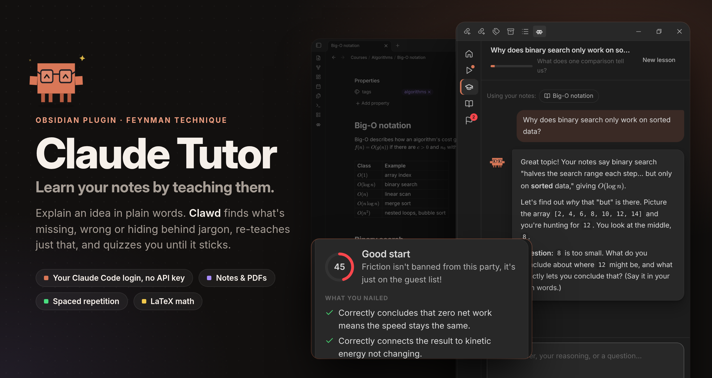
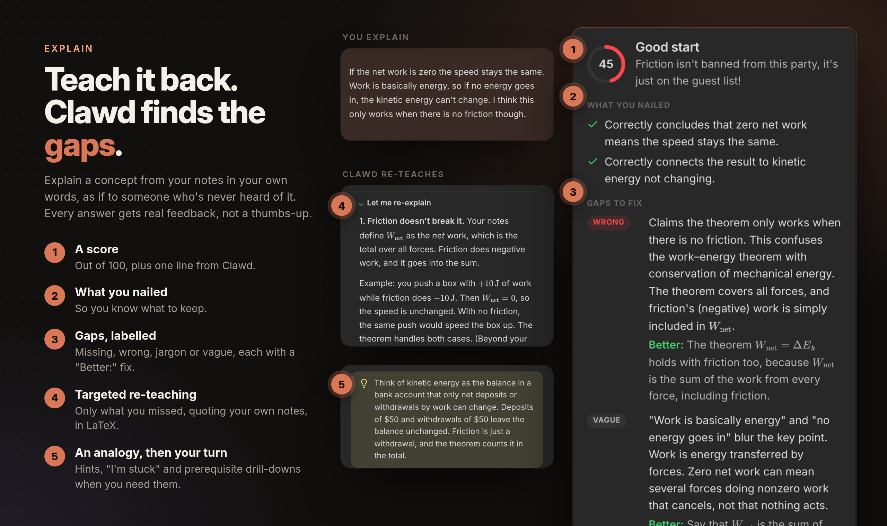
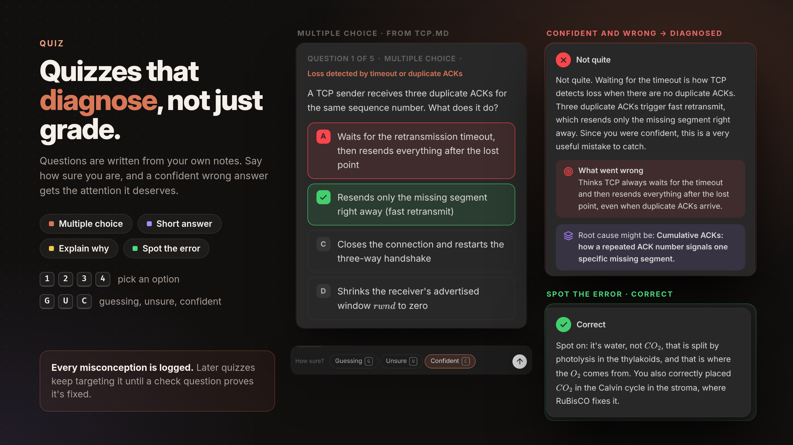
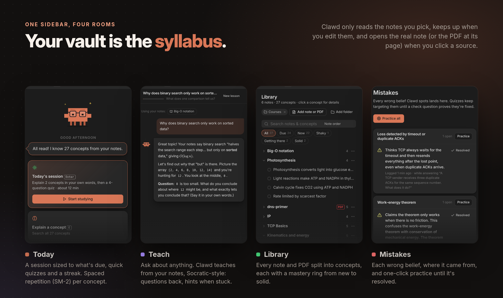
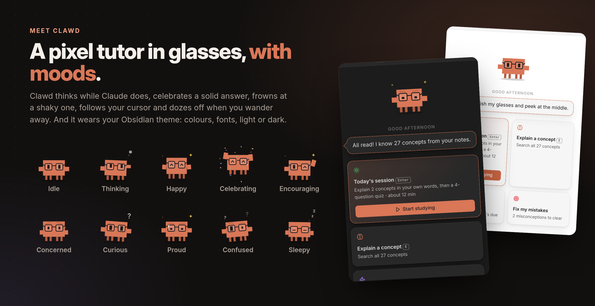

# Claude Tutor for Obsidian



Learn the notes and PDFs in your vault with the **Feynman technique**. Your tutor is Clawd, a pixel tutor in glasses.
You explain an idea in plain words; Clawd finds what's missing, wrong or hidden behind jargon, re-teaches just that,
and quizzes you until it sticks. Claude runs through your **Claude Code login**, so your Pro/Max subscription works
and you don't need an API key.

What it does:

- **Explain**: Feynman loop with a score, what you nailed, gaps (missing / wrong / jargon / vague), targeted re-teaching, an analogy, prerequisite drill-down, hints and "I'm stuck".
- **Quiz**: multiple choice (keys <kbd>1</kbd>–<kbd>4</kbd>), short answer, explain-why and spot-the-error questions, with a confidence rating (keys <kbd>G</kbd> / <kbd>U</kbd> / <kbd>C</kbd>). Wrong answers get a diagnosed misconception, a mini-lesson and a new check question.
- **Composers**: <kbd>Enter</kbd> sends, <kbd>Shift</kbd>+<kbd>Enter</kbd> adds a line, <kbd>Esc</kbd> cancels a reply that's taking too long. Unsent explanations survive closing the view.
- **Ask Clawd** at any point, **spaced repetition** (SM-2) per concept, and a **Mistakes** log that quizzes keep targeting.
- **PDFs**: text extraction (poppler `pdftotext`, falling back to Obsidian's built-in pdf.js), long PDFs split into page ranges, and page citations. Scanned PDFs are listed as unreadable.
- **Math**: Claude writes all formulae as LaTeX (`$…$`, `$$…$$`), and everything is rendered with Obsidian's own Markdown renderer and MathJax, including quiz options, gaps and fixes. Formulas garbled by PDF extraction are written back as LaTeX.
- **Clawd** has 10 moods, follows your cursor, and falls asleep when you leave.

### What's different in Obsidian

- **The library is your vault.** On first run you pick study folders, and you can change them in settings. Right-click any note → **Quiz me on this** / **Explain it to Clawd** to study a single note.
- **Notes stay in sync.** Clawd never reads a note you haven't picked: after adding a folder, you tick the notes you want read on the Today tab. Notes it has already read are re-read in the background after you edit them (can be turned off), and renames keep your progress. Before re-reading many notes at once (25 by default), Clawd asks first, since each one is a Claude request.
- **Notes open in Obsidian.** Clicking a source opens the real note, or the PDF at its page, in a new tab.
- **It looks like your theme.** Colours, fonts and light/dark mode follow Obsidian.
- **Shortcuts stay in the tutor tab.** They only work while it's focused, so they don't clash with your hotkeys.

## See it in action

Every screenshot below is the real plugin running in Obsidian, graded live by Claude.









## Requirements

- Obsidian desktop 1.13+ (the plugin is desktop-only, because it runs the `claude` CLI). On Obsidian 1.8.7–1.12, Obsidian installs version 0.1.3 automatically.
- [Claude Code](https://claude.com/claude-code) installed and logged in. Run `claude` once in a terminal to sign in. The plugin finds it in the usual places (`~/.local/bin`, Homebrew, `/usr/local/bin`); if it doesn't, set the path in settings.
- Optional: `poppler` (`pdftotext`) for the best PDF text.

## Install

Once it's listed in Obsidian's community plugins: **Settings → Community plugins → Browse**, search for **Claude Tutor**, install and enable it.

Until then, download `main.js`, `manifest.json` and `styles.css` from the [latest release](https://github.com/wanikhawar/claude-tutor/releases/latest) into `<vault>/.obsidian/plugins/claude-tutor/`, then enable it under **Settings → Community plugins**.

### From source


```sh
npm install
npm run build                     # type-checks, then writes main.js
VAULT="/path/to/your/vault"
mkdir -p "$VAULT/.obsidian/plugins/claude-tutor"
cp main.js manifest.json styles.css "$VAULT/.obsidian/plugins/claude-tutor/"
```

Then in Obsidian: **Settings → Community plugins → turn on community plugins → enable Claude Tutor**, and click
the Clawd icon in the ribbon (or run the **Claude Tutor: Open** command).

For development, symlink the folder instead and run `npm run dev` to rebuild on save.

## Commands

| Command | |
|---|---|
| Open | Opens the tutor (in the right sidebar, where it resizes with the sidebar; or in a tab if you turn that off in settings) |
| Start study session | Explain due concepts, then a short quiz |
| Quiz me on the current note | Reads the note if needed, then quizzes you on it |
| Explain a concept from the current note | Starts the Feynman loop on its most due concept |
| Re-scan study folders | Reloads the library |

## Data

All data stays in the plugin folder (`.obsidian/plugins/claude-tutor/`):

- `data.json`: settings.
- `progress.json`: concepts, scheduling, attempts and misconceptions. It's written atomically, and a backup is kept if the file can't be read.
- `pdf-cache/`: extracted PDF text.

In your vault, the plugin only writes notes you ask for: **Teach → Save as note** creates a note in `Claude Tutor/Lessons/` (configurable).

Nothing is sent anywhere except to Claude, through your own `claude` CLI: one request per note read, and one per answer graded.

## Disclosures

- **Requires an Anthropic account.** Claude Tutor talks to Claude through [Claude Code](https://claude.com/claude-code), which needs a Claude subscription (Pro/Max) or API billing. Requests count against your plan's usage.
- **Runs an external program.** The plugin starts your locally installed `claude` CLI (and `pdftotext`, if installed) as child processes, passing them your environment with common install folders added to `PATH` so they can be found when Obsidian is launched from the dock. That's why it's desktop-only.
- **Filesystem access outside the vault API.** It checks the usual install locations for the `claude` binary, and replaces `progress.json` with an atomic rename so a crash can't leave it half-written. It doesn't read or write anything else outside your vault.
- **Network use.** Note text, your answers and any images you attach are sent to Anthropic by the `claude` CLI, to evaluate explanations, write quizzes and reply. The plugin itself makes no other network requests and has no telemetry.
- **Lists your vault's files.** To find notes in your study folders, and to offer notes and folders in the **Add note or PDF** / **Add folder** pickers, the plugin lists the files in your vault. It only reads the contents of notes in your study folders (or notes you add one by one).
- **Verifiable releases.** Release files are built by GitHub Actions from this repository and carry [build provenance attestations](https://github.com/wanikhawar/claude-tutor/attestations); check one with `gh attestation verify main.js -R wanikhawar/claude-tutor`.
- **Not affiliated with Anthropic.** This is an independent, community plugin.

## Development

```sh
npm install
npm run build                                   # type-checks, then writes main.js
npm test                                        # core unit tests (notes, PDF reflow/split, SRS, progress)
CLAUDE_LIVE=1 npx vitest run tests/live.test.ts # live test against Claude (Haiku): checks LaTeX output
npm run dev                                     # rebuild main.js on change
```

| Path | Purpose |
|---|---|
| `src/main.ts` | Plugin: view, ribbon, commands, file menu, vault sync, progress file |
| `src/backend.ts` | What the UI calls: indexing, explain/quiz/grade/check, Ask Clawd |
| `src/library.ts` | Study scope, Markdown/PDF loading, PDF cache |
| `src/core/` | Pure TypeScript: Claude bridge, prompts, SM-2, notes, PDF reflow/split, progress store |
| `src/ui/` | Svelte 5 UI (Markdown and MathJax rendered by Obsidian) |
